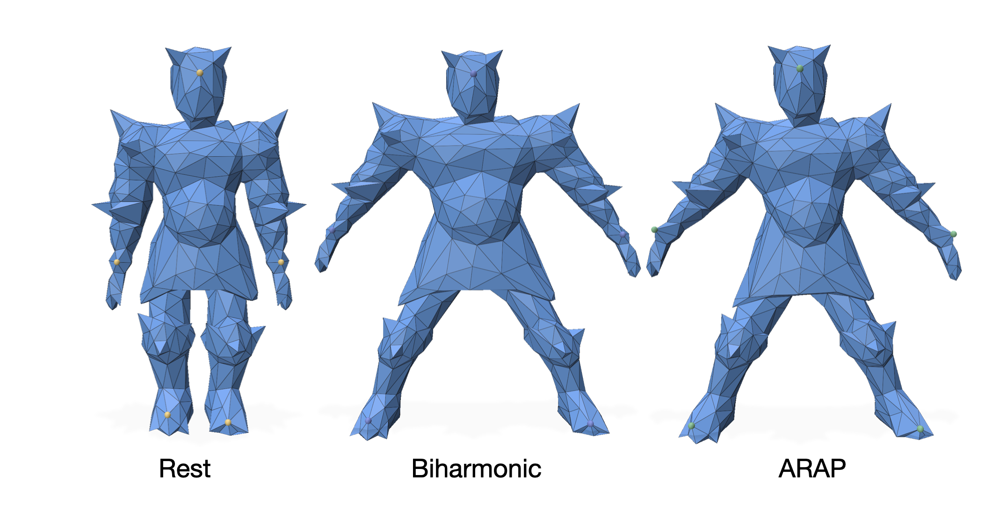

# Overview
Mesh deformation example using biharmonic and ARAP methods.  
Inherited from CSC2520 Geometry Processing [Deformation](https://github.com/alecjacobson/geometry-processing-deformation) Assignment.  
Using polyscope for visualization.  

   

# Execution
> **To get started:** follow instructions below
> 
>     git clone --recursive https://github.com/lzero1115/ARAP_deformation.git
>     cd ARAP_deformation
>     mkdir build
>     cd build
>     cmake ..
>     make
>     ./ARAP [path to mesh]
> 

